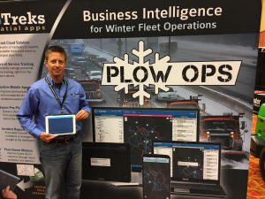

We love sharing what we’ve learned about snowplow tracking at the APWA Western Snow & Ice Conference held in Loveland, CO from Sept. 27 – 29, 2017 to help agencies improve safety and efficiency during winter operations.

The number of regions across the country that experienced historic snow events last winter proved top of mind for attendees. For that reason, industry attitude toward digitizing and optimizing winter operations has truly grown from “nice to have” to “must have.”

Conference-goers agreed that the PlowOps™ snowplow tracking solution provides tremendous improvements in operational efficiency and safety at very low cost. We heard so many different ways fleet managers planned to use PlowOps to drive value for their organization:

- Improve operational awareness and efficiency;
- Real-time fleet tracking;
- Easier route assignments;
- Optimization of routes to reduce costs

Thanks to The National Snow Roadeo, a popular competition that tests the skills and knowledge of equipment operators from around the country, we were able to hear firsthand feedback about PlowOps. Snowplow drivers were most excited about:

- Easier and safer communication during inclement weather;
- Automatic GPS tracking that shows where drivers are and how hard they work to keep the roads safe;
- An overall reduction in distractions while driving.

A big thanks to all the agencies that signed on for our free trial of PlowOps, a low-cost snowplow tracking app that improves the safety and efficiency of your snowplow operations.

  <a class="link--text" href="https://plowops.com/contact">
    Contact us
  </a>{' '}
  today to learn more about how PlowOps can help you become a modern snow
  fighter!

