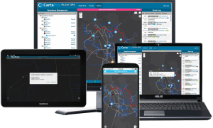

We recently caught up with Austin Mulder, Vice President of Product Development at NeoTreks, to chat about GIS applications, trends government agencies need to know, and why disruptive technologies like PlowOps are the future of winter operations. Keep reading to see the full interview:

##### What’s your role at NeoTreks and how long have you been with the company?

For the past two years, I have been responsible for leading product development through collaborative and agile processes. My goal is to bring new and disruptive products to market, and work with customers to design user experiences that meet their needs. Previously, I was the Vice President of Technology responsible for guiding our organization’s decisions on IT systems and technologies. In all, I have been working for NeoTreks for over seven years.

##### What’s your background in the GIS mobile space?

I have been involved in developing geospatial applications for smartphones since the release of the original iPhone. The team I was working with at the time won the Apple Design Award for Best iPhone Application for iOS 3.0 Beta (also known as iPhone OS 1). Before the advent of smartphones, I was involved in creating geospatial applications for Garmin and Magellan handheld GPS devices.

##### What are some of the industry trends you are seeing that government agencies need to be aware of if they want to evolve into “modern snowfighters?”

As government agencies continue to scale operations, it becomes increasingly important to enhance operational awareness, increase productivity, reduce costs, and facilitate safe and effective communication. Only then will they be able to deal with winter storm events that we see growing in severity season over season.

##### How did working with organizations like WYDOT, IDOT and Montgomery County help spark the idea for PlowOps?

Working with our clients has been a wonderful experience and demonstrates the real need for a simple, cost-effective solution for monitoring and communicating with plow operators. We knew what we were working on was special, but we didn’t realize how much we could help agencies until speaking with public works directors, fleet managers and plow drivers at conferences like APWA.

##### How do you describe PlowOps to someone not very familiar with the latest in mobile technology?

In a way, PlowOps is like most ride-sharing apps like Uber or Lyft. Drivers are given an assignment and then execute that route from point A to point B. There are so many benefits of making plow assignments easier and optimizing routes, especially inside larger organizations with 50+ plows that are simultaneously active during inclement weather.

##### What’s the most exciting part of working with a disruptive solution like PlowOps?

I really enjoy the reactions from our customers once they have used our system for the first time in a live storm event. There is always a little hesitancy when adopting a new system and concern that adding technology will only serve to complicate operations. But, after that first deployment, concerns are quickly replaced with excitement around how many different ways operations will improve.

##### Based on user feedback, what’s the most compelling feature and benefit of using PlowOps?

We have had overwhelming responses to the way PlowOps increases an operations manager’s situational awareness. Always knowing where your drivers are, what route they are clearing, their progress on that route, and having the ability to instantly reroute them to new assignments without ever touching a radio or making a phone call is a game changer. All of this information is now instantly available to a supervisor or operations manager within our PlowOps dashboard. Gone are the days of needing to call each and every driver to request their location and status. This provides huge time savings and allows for far more efficient operations.

##### What’s next on the roadmap for PlowOps?

We have some pretty grand ideas in store for PlowOps. Most exciting for me will be the ability to create what we are calling Storm Plans. This allows for planning ahead of time, well before the storms hit. Operations managers will be able to envision various storm types that occur in their jurisdictions (such as light snow, heavy snow, ice storms, bomb cyclones, etc.) and design plans to handle these different scenarios. Storm Plans will include pretreatment types, road clearing priorities, materials spreading locations, and route assignments—all of which can be tailored to meet the needs of these various types of storm events. Then, whenever these types of storms are forecasted, managers simply create a new storm event in the system, assign the appropriate plan, and all your driver assignments are instantly ready to go.

##### Why should organizations download a free 30-day trial of PlowOps right now?

Organizations have zero risk during a free 30-day trial and will improve the safety and efficiency of snow plowing operations, without the need to purchase and maintain costly hardware and software. Register for free today to quickly and easily see how you can upgrade your operation to digital with very little effort.
