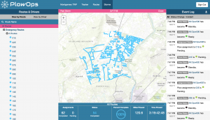

Snow removal contractors have it tough. When a storm hits, everyone wants their roads and properties to be clear of snow … NOW! Reacting quickly to multiple customers—often in the middle of the night—is a real challenge. Keep reading to see how PlowOps can help.

### Manage Your Subcontractors

Simply communicating with plow drivers to understand status, location and critical events can be a challenge. It can be tough to know what your drivers are doing, where they are and how much of the job they’ve completed. It’s even harder when you add in subcontractors.

PlowOps allows you to track your plows on their routes to see status, location and monitor progress. And you can monitor the operation remotely, regardless of where you’re located. Even better, your subcontractors can use their own smart phone or tablet, so you don’t have to shell out money for a new device.

### Protect Your Business

You’ve probably been there before. Life is a highway, then out of nowhere, you’re hit with a lawsuit from a storm event that occurred years ago. You better hope your paperwork is in order. But we both know your paperwork is messy, disorganized and unreliable. And, to make matters worse, your team hates paperwork more than the Grinch hates Christmas.

With digital records at your fingertips, PlowOps will be your best friend forever. You’ll have immediate access to job specifics like when roads were plowed, or why they weren’t. PlowOps will also reduce distractions by lessening the need for drivers to take notes while driving, or place calls over the phone or radio while operating their plows.

PlowOps helps drivers safely communicate in the app with the touch of a button with geo-tagged status reports of weather and road conditions and critical events.

### Manage Your Routes

Uncertain storm events make it hard to plan. It’s common to plow for someone when their contract doesn’t call for it, or to completely forget a new customer. On top of that, rapidly changing road and weather conditions make operations chaotic. Your drivers are only thinking about getting to a site, plowing, salting and heading off to the next site.

PlowOps helps your drivers limit the amount of time spent analyzing. You can efficiently assign routes to a large number of drivers, and assign multiple routes to a single driver, before the storm hits.

With the routes set up ahead of time, your drivers will be able to focus on the current site, instead of doubling back to fix an error. Then, after the storm, you can analyze past storms and fine-tune routes for greater efficiency.

With PlowOps, you’re a modern snow fighter. You don’t just react to storms; you prepare for them!

### What are you waiting for?

PlowOps is a low-cost mobile solution that improves the safety and efficiency of your snow plowing operations, without the need to purchase and maintain costly hardware and software.

Learn more by signing up for our <a href="https://plowops.com/request-demo">FREE 30-day trial today!</a>
